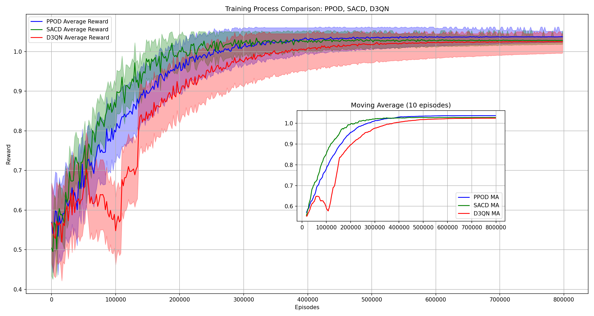
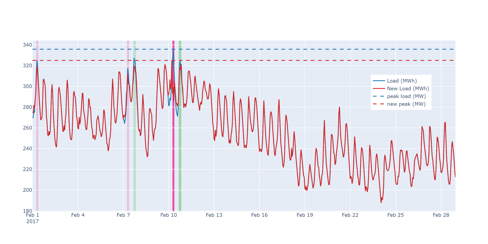

# Targeted Demand Response Through Critical Peak Pricing

[](https://choosealicense.com/licenses/mit/)

This repository contains the implementation of the research conducted in our working paper "Targeted Demand Response Through Critical Peak Pricing", authored by Seyyedreza Madani and Pierre-Olivier Pineau. The study focuses on the impact of Critical Peak Pricing (CPP) as a demand response strategy for peak load shaving in electricity grids, specifically Quebec's. It integrates prosumer behavior and analyzes the role of distributed energy resources like photovoltaic panels, batteries, and electric vehicles. Using reinforcement learning algorithms, the paper evaluates various CPP scenarios, revealing the diminishing effectiveness of CPP with increased prosumer participation and proposing targeted dynamic pricing strategies.


## Repository Structure

`ppod.py`: Implementation of Proximal Policy Optimization with Discrete actions (PPOD).

`sacd.py`: Implementation of Soft Actor Critic with Discrete actions (SACD).

`d3qn.py`: Implementation of Double Dueling Deep Q Network with Prioritized Experience Replay (D3QN).

`home.py`: GymAI environment setup for the problem context.

`Results.ipynb`: Jupyter notebook for visualizations used in the paper.

`utils.py`: Contains useful functions and classes.

`data.ipynb`: Jupyter notebook for data loading, cleaning, preprocessing, and dataset creation.

`dataset/`: Folder containing shareable parts of the dataset.

## Implementation Results
### Algorithm Convergence


### Impact on Monthly Peak Load


## Requirements

| Library             | Version                                                               |
| ----------------- | ------------------------------------------------------------------ |
| Python | 3.7 or higher |
| Pytorch | 1.7 or higher |
| Gurobipy | 10.0.3 or higher |
| openai/gym | 0.25.2 or higher |


## Installation


```bash
  git clone [https://github.com/srmadani/Targeted_Critical_Peak_Pricing.git]
  cd [Targeted_Critical_Peak_Pricing]
```
    
## Deployment

Run each algorithm independently. For example:

```bash
  python ppod.py
```

You can customize various parameters before running the algorithms through command-line arguments:

- General Settings: `--Option (WCO/FXD)`, `--Tar (True/False)`, `--Rate (Consumer rate)`, `--Loadmodel (Load pretrained model)`, `--ModelIdex (Model index)`.
- Training Settings: `--seed (Random seed)`, `--Max_train_steps`, `--save_interval`, `--eval_interval`,`--random_steps`, `--update_every`.

### Example usage

Run ppod.py with custom parameters like:

```bash
  python ppod.py --Option=FXD --Rate=80 --Max_train_steps=1e6
```


## Acknowledgements
 - [RL algorithm references](https://github.com/XinJingHao)
 - [Readme creator](https://readme.so/)

## Questions/Contact

For queries, please contact seyyedreza [dot] madani [at] hec [dot] ca

